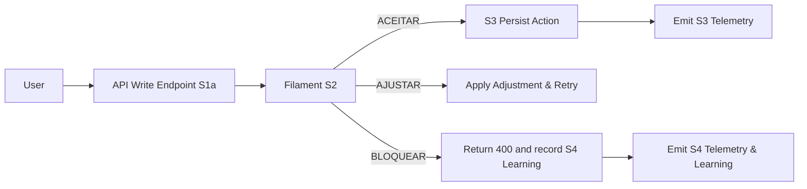

# Dimensional Audit & Action Plan

Date: 2026-01-14

Summary
- **Scope:** audit of planning docs and implemented codebase; enrichment of filament risk model; filament gating added to sandbox execution, payment checkout and Stripe webhook.
- **Goal:** map modules to dimensional states (S1a→S4), identify gaps, and provide a prioritized backlog ready for issues/PRs.

High-level findings
- `dimensional/filament.py`: robust core filament implementation; risk model enriched to include billing/resource signals.
- `sandbox`: executor and Celery task present; added filament gating in `sandbox/tasks.py` (S1a→S1b→S2 → block/adjust/continue).
- `payments`: checkout flow instrumented and now gated by filament; Stripe webhook validated via filament before processing.
- `courses.CourseViewSet.enroll`: already follows dimensional flow and telemetry (S1a→S1b→S2→S3→S4).
- `cognition` (LLM): connector + orchestration exist with retries and circuit breaker; telemetry integrated but risk and filament hooks are not yet applied.
- `telemetry/sdk.py`: sampling and fallback transport present; ensure sampling JSON and fallback path configured per environment.

Module Consolidated Table

| Module / Component | Elements Critical | Gaps / Problems | Suggestion | Owner | Impact / KPI | Priority | Telemetry | Dependencies |
|---|---|---|---:|---|---|---:|---|---|
| `courses` (views/enroll) | Enrollment consistency, cohort capacity | None major — follows filament pattern | Keep; add richer risk signals (historical no-shows) | BE | Enrollment success rate | High | `CourseEnrollment.S1a/S1b/S2/S3/S4` | `Enrollment`, `Cohort` |
| `payments` (checkout + webhook) | Fraud/amount validation, subscription lifecycle | Basic risk heuristics only; external events not previously validated | Use billing history heuristics (added), map customer→user robustly | BE/Payments | Purchase completion, chargeback rate | High | `Payment.S2.filament`, `Payment.Webhook.*` | Stripe, `Payment` model |
| `sandbox` (executor, tasks) | Isolated execution, timeouts, resource controls | Resource history signals missing; executor supports docker/local | Added filament gating; add resource history telemetry and adaptive limits | BE/Infra | Job success rate, timeout rate | High | `ExecutionJob.S2/S4` | Docker/K8s, Celery |
| `cognition` (LLMClient, orchestrator) | Circuit breaker, backoff, telemetry | Filament not integrated; richer signal for prompts/abuse | Add filament hook to escalation and critical turns; rate-limit expensive calls | BE/AI | Response quality, cost per turn | Medium | `llm.turn_*` | LLM providers, vector DB |
| `telemetry` (sdk) | Sampling rules, correlation_id | Sampling config fallback file may be missing; env not documented | Ensure `TELEMETRY_SAMPLING_JSON` or `sampling_config.json` in infra; centralize fallback path | SRE | Observability coverage | High | global | None |
| `dimensional` | Filament core & service | Threshold config per domain lacking (added service) | Centralized service implemented (`dimensional/service.py`) with settings hooks | BE | Auditability | High | filament audit hooks | Global |

Cross-cutting issues
- Telemetry sampling must be configured per environment to avoid noise/cost. Ensure `TELEMETRY_FALLBACK_PATH` writable by service account.
- Correlation id propagation is present in many flows but must be enforced in middleware to avoid missing IDs.
- Tests lacking for filament outcomes (ACEITAR/AJUSTAR/BLOQUEAR) — add unit + integration tests.
- OpenAPI should document filament decision outcomes (400 blocked, 200 adjusted/accepted) for write endpoints.

Quick wins (impactful, short)
- INT-001: Add filament gating to Stripe webhooks (done). 1 day to test and enable in staging.
- INT-002: Add resource-history telemetry for sandbox tasks (1-2 days). Collect 2 weeks of data, then tune thresholds.
- INT-003: Centralize filament thresholds in settings and document them (0.5 day) — implemented `dimensional/service.py`.

Prioritized Backlog (ready-to-create issues)

1) KEY: FIL-001 — `sandbox: record resource history & telemetry`
- Title: Record sandbox resource usage and expose history to filament
- Desc: Emit `ExecutionJob.resource.*` telemetry (cpu_ms, memory_peak, timeouts). Persist per-user job rolling stats; surface `resource_history_score` into filament inputs.
- Labels: backend, telemetry, high
- Priority: High
- Estimate: 2d
- Assignee: backend
- Dependency: `sandbox/executor`, `telemetry/sdk`
- Acceptance: standardized telemetry emitted; filament uses `resource_history_score` and blocks/adjusts accordingly in staging.

2) KEY: FIL-002 — `payments: billing history mapping & risk tuning`
- Title: Map Stripe customer→user and enrich billing heuristics
- Desc: Ensure `Payment.customer_id` stored; compute `billing_history_score` from past failures, chargebacks, refunds; tune filament weights in settings.`
- Labels: backend, payments, high
- Priority: High
- Estimate: 2d
- Assignee: payments
- Dependency: Stripe config, `payments.models`
- Acceptance: webhook filament uses billing score; simulated webhook with forged high-risk payload results in `BLOQUEAR` in staging.

3) KEY: FIL-003 — `telemetry: sampling config and middleware`
- Title: Enforce correlation_id and sampling config per env
- Desc: Add middleware to ensure `correlation_id` present on all requests; configure `TELEMETRY_SAMPLING_JSON` for staging/prod; ensure fallback path exists.
- Labels: infra, telemetry, medium
- Priority: Medium
- Estimate: 1d
- Assignee: infra
- Dependency: deployment
- Acceptance: all incoming requests have `correlation_id`; telemetry sampling obeys configured rates.

4) KEY: FIL-004 — `cognition: filament integration for critical turns`
- Title: Add filament checks around LLM escalation points
- Desc: Before high-cost LLM calls or when `needs_human` is true, validate via filament to avoid runaway costs or unsafe outputs.
- Labels: ai, backend, medium
- Priority: Medium
- Estimate: 2d
- Assignee: ai
- Dependency: `dimensional.service`
- Acceptance: sample flows where LLM would escalate are blocked/adjusted per filament in staging.

5) KEY: FIL-005 — `tests: filament decision unit tests`
- Title: Add unit tests for filament outcomes and integration tests for sandbox+payments
- Desc: Cover ACEITAR/AJUSTAR/BLOQUEAR conditions; mock dimensions to assert expected decisions and side-effects.
- Labels: tests, backend
- Priority: High
- Estimate: 2d
- Assignee: qa
- Dependency: none
- Acceptance: CI includes tests and passes locally.

Mermaid — Integrated flow (simplified)

Next steps (recommended immediate actions)
1. Create issues from backlog items (FIL-001..FIL-005) and assign to owners; open PRs for small fixes (tests, telemetry sampling).
2. Deploy filament changes to staging and run simulated high-load / high-amount payment and long-running sandbox jobs.
3. Add unit/integration tests for filament outcomes and include in CI.
4. Update OpenAPI docs to document filament outcomes for `POST` / write endpoints.

Files changed in this audit
- `dimensional/filament.py` (risk model enrichment)
- `dimensional/service.py` (new) — centralized factory for filament services
- `sandbox/tasks.py` — added filament gating
- `payments/views.py` — added filament to checkout + webhook

If you want, I can now:
- create the GitHub issues for the backlog items, or
- implement FIL-001 (sandbox resource telemetry) next and add tests.

-- End of report
