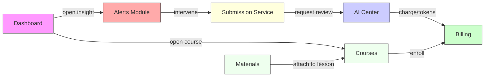

# Relatório Executivo Consolidado — Synapse (Resumo)

Data: 2026-01-14
Autor: Product / Arquitetura

## 1) Objetivo
Consolidar diagnóstico dimensional, recomendações prioritárias e backlog pronto para execução. Entrega rápida para squads: tickets CSV, testes de telemetria (INT-001) e audit service skeleton (INT-002).

## 2) Síntese Executiva
- Módulos críticos: Dashboard, Alerts, Courses, Course Detail, Lesson Submission, Materials, AI Center, Billing.
- Principal risco: falta de persistência de audit logs (S4) e ausência de enforcement de `correlation_id` (telemetry contract not enforced).
- Recomendações de curto prazo: INT-001 (telemetry contract tests) e INT-002 (audit service) para garantir rastreabilidade e compliance.

## 3) Tabela consolidada (ver também `docs/planning/diagnosis_table.md`)
- Local: [docs/planning/diagnosis_table.md](docs/planning/diagnosis_table.md)
- Backlog inicial: [docs/planning/initial_backlog.csv](docs/planning/initial_backlog.csv)

## 4) Fluxo Integrado (Mermaid)

## 5) Acceptance / Sprint-ready criteria (exemplo)
- Telemetry: all S1a events include `correlation_id`, `user_id` (nullable), and `timestamp`.
- Audit: critical actions (alerts interventions, submission results, material associations, billing events) persist an S4 entry with `audit_id` and are queryable by `correlation_id`.
- UX: skeletons/toasts present for primary actions; modal open <= 300ms (cached) where specified.

## 6) Próximos passos imediatos (curto prazo)
1. Merge PR INT-001 — run telemetry contract tests in CI (blocking). (owner: infra)
2. Merge PR INT-002 — provide append-only audit service shim (owner: backend)
3. Run `scripts/create_github_issues.py docs/planning/initial_backlog.csv <owner> <repo>` to create issues from backlog and assign owners.
4. Sprint 0: implement PL-001 (Dashboard insight) and ALERT-001 (Intervention modal) as highest-impact items.

## 7) Artefatos gerados
- Diagnosis table: `docs/planning/diagnosis_table.md` / `.csv`
- Backlog CSV: `docs/planning/initial_backlog.csv`
- Telemetry schemas: `docs/planning/schemas/*.schema.json`
- Telemetry contract tests: `tests/test_telemetry_contract.py` (already present)
- Audit service shim: `core/audit_service.py` + usage doc `docs/planning/usage_audit.md`
- Helper scripts: `scripts/create_github_issues.py`, `scripts/create_pr.sh`

## 8) Recomendações de governança
- Add an automated CI job: `pytest tests/test_telemetry_contract.py` on push to `main`/PRs.
- Enforce `correlation_id` presence via SDK/utility in FE and BE; add precommit hook or lint rule.
- Create a runbook for audit retention and access control for `AuditService`.

## 9) Próximos workshops / reuniões
- Telemetry workshop: review schema and sampling rules (1h)
- Audit & Compliance: define retention, ACLs, export formats (1.5h)

---

Se quiser, abro as issues automaticamente (executando o script) e crio branches/PRs locais para INT-001 e INT-002 (requer `GITHUB_TOKEN` e `gh` CLI se desejar abrir PRs automaticamente).